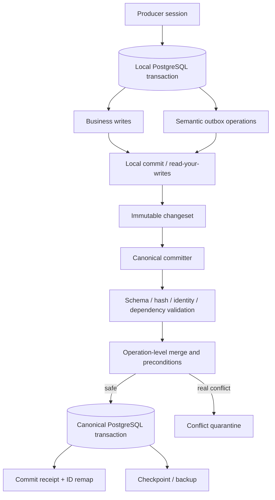
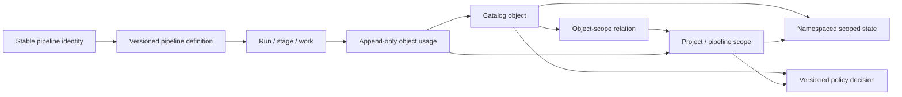

# Target architecture

Status: `ACCEPTED BASELINE + INFRASTRUCTURE/SCOPE SUPPLEMENTS`

## 1. Core model

The architecture is best described as:

> PostgreSQL transactional branches and typed workers, semantic transactional outbox,
> deterministic single canonical committer, versioned connector intake, first-class
> platform/project/pipeline scopes, append-only evidence and versioned encrypted
> checkpoints.

This is not generic event sourcing, transparent multi-master replication or replay of
raw SQL.

## 2. Canonical state and availability

A canonical state is identified by:

```text
canonical_revision
schema_version
checkpoint_manifest_hash
parent_manifest_hash
postgres_major
extension_versions
```

On the initial devstand profile, one supervised PostgreSQL instance materializes the
latest canonical revision. It is normally always on and restarts after process/host
failure. Periodic encrypted checkpoints and portable logical backups allow exact
reconstruction.

Kaggle is not a database failover and never hosts a writable master database. If the
devstand is unavailable, producers retain exact idempotent batches in durable local
spools and retry after recovery. A future external Yandex availability controller may
start the host, but the orchestrator cannot wake itself when its host/database are down.

Detached producers use a specific revision and return semantic changesets, connector
batches or typed results. They never advance the canonical pointer themselves.

## 3. Canonical data and compute plane



For pure ML workers, the job/result adapter may bypass a full producer branch: a worker
consumes immutable input and returns a typed result. The orchestrator records that result
and its semantic operations inside one canonical PostgreSQL transaction. The remote
worker does not write canonical state.

## 4. Connector ingress plane

Owned services and external adapters integrate through a versioned connector boundary:

```text
producer durable spool
→ authenticated HTTPS intake
→ immutable batch + idempotency receipt
→ validation / staging / quarantine
→ server-side consumer routing
→ independent per-consumer application
→ versioned normalizer
→ canonical committer
→ reconciliation receipt
```

Supported modes are push, orchestrator pull, immutable artifact handoff and exceptional
trusted database landing. Direct writes into shared canonical tables are not a connector
protocol. The first real planned connector is `events-bot.daily-statistics.v1`.

The canonical contract is documented in
[`16-data-connectors.md`](16-data-connectors.md).

## 5. Control plane

PostgreSQL stores:

- projects, stable logical pipeline identities and immutable/versioned pipeline definitions;
- platform/project/pipeline/project-pipeline scopes and project-pipeline associations;
- object-scope relations, namespaced states, append-only usage and policy decisions;
- durable work items;
- leases with expiration and fencing token;
- stage attempts and terminal outputs;
- retries and blocked reasons;
- changeset/connector status and commit receipts;
- external side-effect outbox;
- migration progress and validation findings;
- provider resources, control classes and operation receipts;
- operator preview/apply/audit evidence.

Cron/systemd is only a wake-up mechanism. A tick asks durable state what should happen
next, performs bounded work, records the result and exits. Missed ticks are recovered
from state.

## 6. Kaggle provider plane

Kaggle provides compute and private artifact capabilities. Every notebook and private
dataset visible to the configured account is reconciled into a PostgreSQL registry.
Authorization is based on registry control class, not naming convention:

- `orchestrator_protected` — status only through remote MCP;
- `mcp_managed` — provider-supported lifecycle through scoped MCP;
- `mcp_exchange` — TTL-bound private file/document/code package;
- `external_read_only` — discovery metadata/status only until explicit adoption.

All datasets created by `my-data-hub` are private. Backup/checkpoint resources are
orchestrator-protected. Provider artifacts never determine canonical head.

See [`17-kaggle-control-plane.md`](17-kaggle-control-plane.md).

## 7. MCP and operator plane

The default MCP exposes typed semantic tools. A distinct privileged profile adds broad
bounded reads and controlled DML without exposing a database owner/superuser:

- `semantic_default` — product and orchestration commands;
- `data_reader` — read-only SQL in allowlisted application schemas;
- `data_editor` — preview/apply DML under a restricted PostgreSQL role;
- `migration_operator` — typed migration lifecycle and gates;
- `kaggle_operator` — control-class-aware provider operations;
- local-only `break_glass_admin` — structural administration outside normal remote MCP.

Database grants are the primary boundary; parsers, limits, scopes, backup freshness,
preview receipts and audit are defense in depth. Generic editor DML cannot falsify
migration accounting, change protected provider ownership or enable publication.

See [`18-mcp-operator-and-database-access.md`](18-mcp-operator-and-database-access.md).

## 8. Storage planes

### Canonical core

Compact business objects, explicit project/pipeline relations, namespaced scoped state,
versioned policy decisions, provenance, review and publication state.

### Derived projections

FTS vectors, embeddings, analyzer projections and reports. They must be reproducible
from canonical input plus model/policy version.

Large vector state may be checkpointed independently from the frequently changing core
once measurements justify it.

### Connector and migration landing

Exact accepted connector envelopes and imported source rows, hashes, table/source
identity, lifecycle and outcome mapping. Landing is immutable and retention-controlled.
It is not queried as normal product state.

### Artifact storage

Notebook outputs, exchange packages, encrypted checkpoints, manifests and receipts.
Artifact storage is not a database and cannot decide which revision is canonical.

## 9. Data scope and policy plane

A shared object is stored once and can participate in several projects/pipelines without
copying its canonical identity:



The architecture deliberately separates:

- entity lifecycle from project membership;
- persistent relation from a historical pipeline usage event;
- workload state from execution state in `orchestration.work_item`;
- normalized cross-pipeline state class from exact namespaced state;
- workflow state from an authorization/policy decision.

Applicable platform/project/pipeline policies are combined by a versioned policy
definition. Publication uses a deny-overrides combiner: a platform-wide hard deny/blacklist
cannot be weakened by a local allow. Every external effect cites the exact scope, object
revision and policy-evaluation receipt.

Raw connector/migration rows may inherit scope through an immutable batch; child and
derived rows may resolve scope through a canonical parent or run. The system does not add
ad-hoc `project_id`/`pipeline_id` columns to every physical row, but it rejects required data
whose scope lineage is ambiguous.

See
[`22-data-scope-and-pipeline-participation.md`](22-data-scope-and-pipeline-participation.md)
and ADR-0015.

## 10. Concurrency and ordering

- local database concurrency uses normal PostgreSQL MVCC;
- session transactions have monotonically increasing `session_seq`;
- dependencies form a DAG by changeset ID;
- the committer assigns `canonical_commit_seq`;
- connector acceptance and canonical application are distinct idempotent transitions;
- provider mutations use local leases and expected provider fingerprints;
- wall-clock timestamps are audit metadata, not conflict order;
- stale base revision is context, not automatic rejection of every operation;
- operation preconditions decide whether a change still applies.

## 11. Merge classes

| Class | Examples | Policy |
|---|---|---|
| Idempotent | same discovery, same analysis identity, exact connector replay | no-op/deduplicate |
| Set union | attach any catalog object to another scope, add tag | merge and preserve all relations |
| Append-only | provenance, scoped-state, usage, policy, connector/provider/operator event | append by stable event ID |
| Conditional | canonical summary edit, state transition | expected revision/precondition |
| Domain merge | duplicate actor/account/material | explicit identity resolution + ID map + union scope relations |
| Correction | revised daily statistics/source observation | append and supersede prior batch |
| Rebuildable | FTS, derived metrics | recompute |
| External side effect | Telegram publication | forbidden before canonical commit and approval |

## 12. Deployment profiles

### A. Initial devstand / production

- PostgreSQL 18 + pgvector, supervised and private;
- orchestrator, API and MCP as systemd or Compose services;
- public HTTPS only at `mcp-datahub.kenigevents.ru`;
- OAuth/resource validation for remote MCP;
- regular encrypted local and off-host backup;
- scheduled CI/devstand/provider/restore evidence;
- dangerous scheduler, publication and write profiles off until gates pass.

### B. Detached notebook/agent

- exact job/revision input;
- local PostgreSQL branch only when transactional state is needed;
- semantic changeset, connector batch, exchange package or typed result output;
- eventual reconciliation by the single committer.

### C. Recovery

- restore exact portable backup/checkpoint;
- verify manifest and migration hashes;
- replay unapplied semantic changesets/connector batches idempotently;
- rebuild derived indexes;
- advance canonical pointer only after readback verification.

## 13. Test-first release rule

The platform proves infrastructure before Region Talk migration:

```text
clean migrations and roles
→ backup/readback/restore
→ CI and devstand workflows
→ remote read-only MCP
→ scope/policy migration and backfill proof
→ synthetic multi-consumer connector
→ Kaggle protected/MCP-managed canary
→ operator disposable-schema canary
→ Region Talk inventory/migration
```

See [`15-infrastructure-first-plan.md`](15-infrastructure-first-plan.md) and
[`19-test-first-rollout.md`](19-test-first-rollout.md).

## 14. What is deliberately not used

- PostgreSQL logical replication as offline merge protocol;
- raw WAL as business intent;
- Kaggle notebook/dataset as master database or automatic canonical failover;
- direct connector writes to shared canonical tables;
- one universal status or project/pipeline copy of each shared object;
- inference of membership/authorization from schema names, work status or provenance text;
- remote PostgreSQL owner/superuser through MCP;
- resource-name prefixes as Kaggle authorization;
- Doltgres while pgvector/extensions/compatibility remain insufficient;
- PowerSync/Electric as canonical write architecture;
- global CRDT treatment for state transitions or uniqueness;
- SQLite as an intermediate Region Talk backend.
