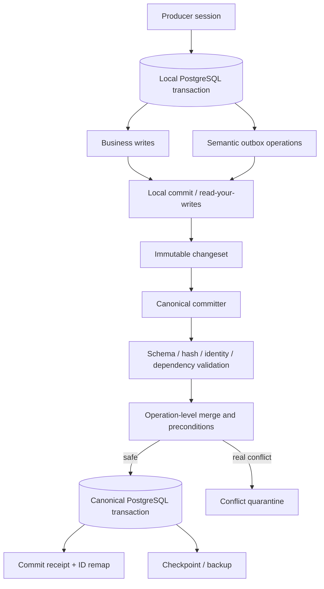

# Target architecture

Status: `ACCEPTED_BASELINE`

## 1. Core model

The architecture is best described as:

> PostgreSQL transactional branches and typed workers, semantic transactional outbox, deterministic single canonical committer, append-only evidence and versioned encrypted checkpoints.

This is not generic event sourcing, transparent multi-master replication or replay of raw SQL.

## 2. Canonical state

A canonical state is identified by:

```text
canonical_revision
schema_version
checkpoint_manifest_hash
parent_manifest_hash
postgres_major
extension_versions
```

On the initial devstand profile, the live PostgreSQL instance materializes the latest canonical revision. Periodic encrypted checkpoints and portable logical backups allow exact reconstruction.

Detached producers use a specific revision and return semantic changesets. They never advance the canonical pointer themselves.

## 3. Data plane



For pure ML workers, the job/result adapter may bypass a full producer branch: a worker consumes immutable input and returns a typed result. The orchestrator then records that result and its semantic operations inside one canonical PostgreSQL transaction. The invariant remains the same: the remote worker does not write canonical state.

## 4. Control plane

PostgreSQL stores:

- project and pipeline definitions;
- durable work items;
- leases with expiration and fencing token;
- stage attempts and terminal outputs;
- retries and blocked reasons;
- changeset status and commit receipts;
- external side-effect outbox;
- migration progress and validation findings.

Cron/systemd is only a wake-up mechanism. A tick asks durable state what should happen next, performs bounded work, records the result and exits. Missed ticks are recovered from state.

## 5. Storage planes

### Canonical core

Compact business objects, relationships, provenance, review and publication state.

### Derived projections

FTS vectors, embeddings, analyzer projections and reports. They must be reproducible from canonical input plus model/policy version.

Large vector state may be checkpointed independently from the frequently changing core once measurements justify it.

### Migration landing

Exact imported source rows, row hashes, table identity and outcome mapping. Landing is immutable and retention-controlled. It is not queried as normal product state.

### Artifact storage

Notebook outputs, encrypted checkpoints, manifests and receipts. Artifact storage is not a database and cannot decide which revision is canonical.

## 6. Concurrency and ordering

- local database concurrency uses normal PostgreSQL MVCC;
- session transactions have monotonically increasing `session_seq`;
- dependencies form a DAG by changeset ID;
- the committer assigns `canonical_commit_seq`;
- wall-clock timestamps are audit metadata, not conflict order;
- stale base revision is context, not an automatic rejection of every operation;
- operation preconditions decide whether a change still applies.

## 7. Merge classes

| Class | Examples | Policy |
|---|---|---|
| Idempotent | same discovery, same analysis identity | no-op/deduplicate |
| Set union | attach material to another project, add tag | merge |
| Append-only | provenance event, pipeline event | append by stable event ID |
| Conditional | canonical summary edit, state transition | apply only when expected revision/precondition holds |
| Domain merge | duplicate actor/account/material | explicit identity resolution + ID map |
| Rebuildable | FTS, derived metrics | recompute |
| External side effect | Telegram publication | forbidden before canonical commit and approval |

## 8. Deployment profiles

### A. Initial devstand / production

- PostgreSQL 18 + pgvector;
- orchestrator and MCP as systemd or Compose services;
- local/private network only;
- regular encrypted logical backup;
- optional checkpoint publication to private Kaggle after PoC.

### B. Detached notebook/agent

- exact job/revision input;
- local PostgreSQL branch when transactional state is needed;
- semantic changeset or typed result output;
- eventual reconciliation by the single committer.

### C. Recovery

- restore exact portable backup/checkpoint;
- verify manifest and migration hashes;
- replay unapplied semantic changesets idempotently;
- rebuild derived indexes;
- advance canonical pointer only after readback verification.

## 9. What is deliberately not used

- PostgreSQL logical replication as offline merge protocol;
- raw WAL as business intent;
- Doltgres while pgvector/extensions/compatibility remain insufficient;
- PowerSync/Electric as canonical write architecture;
- global CRDT treatment for state transitions or uniqueness;
- SQLite as an intermediate Region Talk backend.
