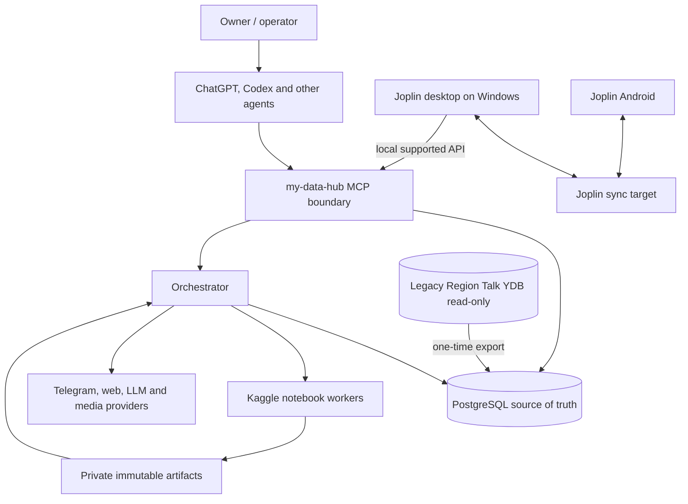

# System context

## Trust boundaries

- **Public repository:** code, schemas, migrations, synthetic fixtures and documentation.
- **Devstand private runtime:** PostgreSQL, orchestration state, credentials and MCP.
- **Kaggle private runtime:** bounded inputs, temporary models and immutable outputs.
- **External providers:** untrusted input and explicit side-effect boundaries.
- **Joplin desktop:** locally trusted user process; its token never leaves the machine.
- **YDB:** temporary read-only migration source, not a peer after cutover.

## Consistency model

The canonical runtime is ordinary PostgreSQL ACID. Parallel or intermittent producers
do not receive general database credentials. They submit idempotent semantic commands or
immutable worker results. The canonical service validates expected revisions, invariants
and dependencies in one PostgreSQL transaction and records an outbox event in that same
transaction.

There is one canonical order of accepted revisions. Wall-clock timestamps are evidence,
not the conflict resolver.
