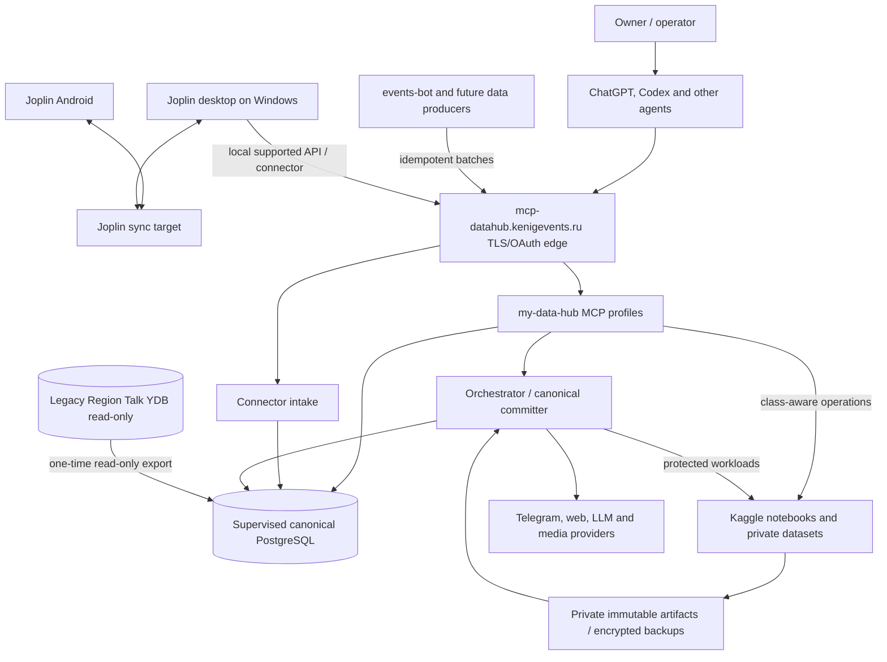

# System context

## Trust boundaries

- **Public repository:** code, schemas, migrations, synthetic fixtures and documentation.
- **Public edge:** HTTPS/OAuth gateway only; no PostgreSQL/internal ports.
- **Devstand private runtime:** PostgreSQL, orchestration state, credentials, MCP/intake
  upstreams and local backups.
- **Kaggle private runtime:** bounded inputs, temporary models, private datasets and
  immutable outputs; never canonical database.
- **External providers:** untrusted input and explicit side-effect boundaries.
- **Joplin desktop:** locally trusted user process; its token never leaves the machine.
- **YDB:** temporary read-only migration source, not a peer after cutover.

## Availability model

Canonical PostgreSQL is supervised and normally always on. If the devstand is down,
connector producers retain exact batches in durable local spools. Kaggle does not become
an alternate master. A future infrastructure controller may start the host independently
of the orchestrator.

## Consistency model

The canonical runtime is ordinary PostgreSQL ACID. Parallel/intermittent producers submit
idempotent semantic commands, connector batches or immutable worker results. The
canonical service validates expected revisions, identities, hashes and dependencies in
one PostgreSQL transaction and records required receipts/outbox evidence.

Trusted remote operators may use a segregated restricted role for bounded reads and
preview/apply DML. This does not create a second canonical writer: successful operations
still commit through the same PostgreSQL head and audit boundary.

There is one canonical order of accepted revisions. Wall-clock timestamps are evidence,
not the conflict resolver.
