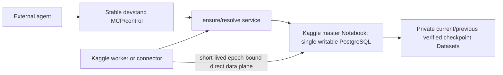

# System context

The devstand stores operational metadata only. It has no production PostgreSQL, PGDATA or
canonical business rows. When the master is ABSENT, control health remains ready and data
operations wait/fail closed.
